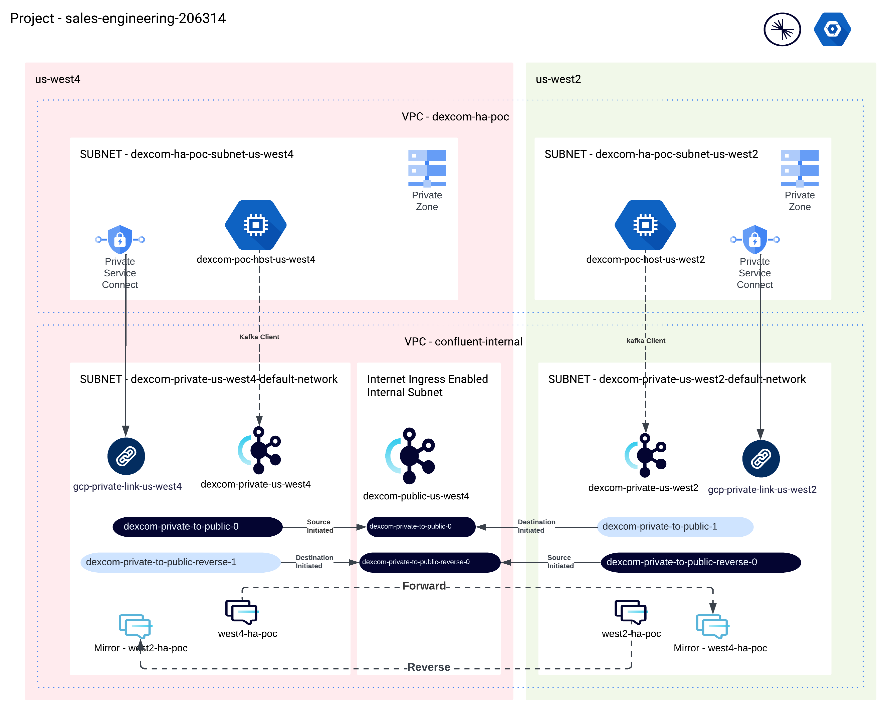

# Private-Private Cluster Linking via Public Jump on GCP

This project is a live demonstration of Cluster link chaining. This is intended to be used as a demo to showcase cluster linking of two clusters in different regions on Google Cloud VPC. The idea is to use jump clusters with cluster chaining to achieve it. 

## Architecture 




## Setup 

Here are the steps to setup the Jump cluster based private-private cluster linking with GCP and Confluent Cloud for Kafka clusters part of two different regions.

### Running Local Setup

#### 1. Prerequisite

##### a. Define Confluent Environment & Google Project

```console
export CONFLUENT_ENV=<YOUR_CC_ENVIRONMENT>
export GCP_PROJECT=<YOUR_GCP_PROJECT>
```
##### b. Authenticate to GCP and Confluent Cloud

```console
gcloud auth application-default login 
confluent login --save
```

##### c. Create Confluent Cloud Cloud API Key, Skip this step if you already have the Cloud API Key
```console
confluent api-keys create confluent api-key create --resource cloud --environment $CONFLUENT_ENV 
```
You will need the KEY and SECRET generated in this step in the next step.
##### d. Define the terraform tfvars
```console 
export TF_VAR_confluent_api_key=<CC_CLOUD_API_KEY>
export TF_VAR_confluent_api_secret=<CC_CLOUD_API_SECRET>
export TF_VAR_confluent_env=$CONFLUENT_ENV 
export TF_VAR_gcp_project_id=$GCP_PROJECT
```

#### 2. Infrastructure Setup

##### a. Initialize Terraform 
```console
terraform init
```
##### b. Define Terraform for GCP & Confluent Components
```console
terraform apply -target module.gcp-setup
```

##### c. Define Private Link between Confluent & GCP
```console
terraform apply -target module.private-link-0 module.private-link-1
```

#### 3. Running Remote Setup

#### a. GCP Init
GCP Auth for accessing GCE VM
```console
gcloud auth login
```
Get this value from the GCP console
```console
export GCP_WEST2_VM=<GCP_WEST2_VM_NAME>
export GCP_WEST4_VM=<GCP_WEST4_VM_NAME>
export GCP_WEST4_PUBLIC_VM=<GCP_WEST4_PUBLIC_VM_NAME>
```

#### b. Forward Cluster Link Setup 

##### i. SSH into US West 4 Private
```console
gcloud compute ssh --zone "us-west4-a" "dexcom-poc-host-us-west4" --project "sales-engineering-206314"
```

##### ii. Setup basic tools
```console
sudo apt-get update && sudo apt-get install netcat default-jre default-jdk nginx -y

curl --output kafka.tgz https://dlcdn.apache.org/kafka/3.7.0/kafka_2.13-3.7.0.tgz

tar -xvf kafka.tgz && PATH=$PATH:~/kafka_2.13-3.7.0/bin

mkdir confluent && curl -sL --http1.1 https://cnfl.io/cli | sh -s -- -b ./confluent latest

export PATH=$(pwd)/confluent:$PATH
```
##### iii. Confluent Setup
```console
confluent login 
confluent env use $CONFLUENT_ENV
```

##### iv. Create Source initiated Cluster link to us-west4 public cluster from us-west4 private cluster
```console
export WEST4_PUBLIC=<us-west-4-public-cluster-id>
export WEST4_PRIVATE=<us-west-4-private-cluster-id>
export US_WEST4_PUBLIC_BOOTSTRAP=SASL_SSL://pkc-xxxxxx.us-west4.gcp.confluent.cloud:9092

mkdir cluster-link && cd cluster-link

# DEFINE THE PUBLIC HALF OF SOURCE INITIATED CL

echo -e "link.mode=DESTINATION\nconnection.mode=INBOUND" > public-destination-link.config

confluent kafka link create private-to-public-0 --cluster $WEST4_PUBLIC  --config public-destination-link.config   --source-cluster $WEST4_PRIVATE

# DEFINE A SERVICE ACCOUNT TO USE WITH BOTH CLUSTERS

confluent iam service-account create private-to-public --description "For my first cluster link"
# +-------------+---------------------------+
# | ID          | sa-xxxxxx                 |
# | Name        | private-to-public  |
# | Description | For my first cluster link |
# +-------------+---------------------------+

export US_WEST4_SA="sa-xxxxxx"

# DEFINE REQUIRED ACLs FOR BOTH CLUSTERS WITH A SINGLE SERVICE PRINICPAL

confluent kafka acl create --allow --service-account $US_WEST4_SA --operations read,describe-configs --topic "*" --cluster $WEST4_PRIVATE

confluent kafka acl create --allow --service-account $US_WEST4_SA --operations describe --cluster-scope --cluster $WEST4_PRIVATE
  
confluent kafka acl create --allow --service-account $US_WEST4_SA --operations describe --topic "*" --cluster $WEST4_PRIVATE

confluent kafka acl create --allow --service-account $US_WEST4_SA  --operations read,describe --consumer-group "*" --cluster $WEST4_PRIVATE

confluent kafka acl create --allow --service-account $US_WEST4_SA --operations alter --cluster-scope --cluster $WEST4_PRIVATE

confluent kafka acl create --allow --service-account $US_WEST4_SA --operations alter --cluster-scope --cluster $WEST4_PUBLIC


# CREATE API KEYS WITH COMMON SERVICE PRINICPAL ON EACH CLUSTER

confluent api-key create --resource $WEST4_PRIVATE --service-account $US_WEST4_SA

# +------------+------------------------------------------------------------------+
# | API Key    | XXXXXXXXXXXXXXXXXXX                                                |
# | API Secret | ZZZZZZZZZZZZZZZZZZZZZZZZZZZZZZZZZZZZZZZZZZZZZZZZZZZZZZZZZZZZZZZZZZ |
# +------------+------------------------------------------------------------------+

export WEST4_PRIVATE_CL_API_KEY="XXXXXXXXXXXXXXXXXXX"
export WEST4_PRIVATE_CL_API_SECRET="ZZZZZZZZZZZZZZZZZZZZZZZZZZZZZZZZZZZZZZZZZZZZZZZZZZZZZZZZZZZZZZZZZZ"

confluent api-key create --resource $WEST4_PUBLIC --service-account $US_WEST4_SA

# +------------+------------------------------------------------------------------+
# | API Key    | XXXXXXXXXXXXXXXXXXX                                                |
# | API Secret | ZZZZZZZZZZZZZZZZZZZZZZZZZZZZZZZZZZZZZZZZZZZZZZZZZZZZZZZZZZZZZZZZZZ |
# +------------+------------------------------------------------------------------+

export WEST4_PUBLIC_CL_API_KEY="XXXXXXXXXXXXXXXXXXX"
export WEST4_PUBLIC_CL_API_SECRET="ZZZZZZZZZZZZZZZZZZZZZZZZZZZZZZZZZZZZZZZZZZZZZZZZZZZZZZZZZZZZZZZZZZ"

# CREATE PRIVATE HALF OF THE US WEST 4 CL

echo -e "link.mode=SOURCE\nconnection.mode=OUTBOUND\nsecurity.protocol=SASL_SSL\nsasl.mechanism=PLAIN\nsasl.jaas.config=org.apache.kafka.common.security.plain.PlainLoginModule required username=$WEST4_PUBLIC_CL_API_KEY password=$WEST4_PUBLIC_CL_API_SECRET;\nlocal.security.protocol=SASL_SSL\nlocal.sasl.mechanism=PLAIN\nlocal.sasl.jaas.config=org.apache.kafka.common.security.plain.PlainLoginModule required username=$WEST4_PRIVATE_CL_API_KEY password=$WEST4_PRIVATE_CL_API_SECRET;" > private-source-link.config

confluent kafka link create private-to-public-0 \
  --cluster $WEST4_PRIVATE \
  --destination-cluster $WEST4_PUBLIC \
  --destination-bootstrap-server $US_WEST4_PUBLIC_BOOTSTRAP \
  --config private-source-link.config

# VERIFY BY LISTING CLUSTER LINKS

confluent kafka link list --cluster $WEST4_PUBLIC
confluent kafka link list --cluster $WEST4_PRIVATE

# CREATE THE MIRROR TOPIC

confluent kafka topic list --cluster $WEST4_PRIVATE
#       Name     | Internal | Replication Factor | Partition Count  
# ---------------+----------+--------------------+------------------
#   west4-ha-poc | false    |                  3 |               6  

export US_WEST4_MIRROR_TOPIC="west4-ha-poc"

confluent kafka mirror create $US_WEST4_MIRROR_TOPIC --link dexcom-private-to-public-0 --cluster $WEST4_PUBLIC
```
##### v. SSH into US West 2 Private
```console
gcloud compute ssh --zone "us-west2-a" "dexcom-poc-host-us-west2" --project "sales-engineering-206314"
```

##### vi. Setup basic tools
```console
sudo apt-get update && sudo apt-get install netcat default-jre default-jdk nginx -y

curl --output kafka.tgz https://dlcdn.apache.org/kafka/3.7.0/kafka_2.13-3.7.0.tgz

tar -xvf kafka.tgz && PATH=$PATH:~/kafka_2.13-3.7.0/bin

mkdir confluent && curl -sL --http1.1 https://cnfl.io/cli | sh -s -- -b ./confluent latest

export PATH=$(pwd)/confluent:$PATH
```
##### vii. Confluent Setup
```console
confluent login 
confluent env use $CONFLUENT_ENV
```

##### viii.Create Destination initiated Cluster link to us-west4 public cluster from us-west2
```console
export WEST4_PUBLIC=<us-west-4-public-cluster-id>
export WEST2_PRIVATE=<us-west-2-private-cluster-id>
export US_WEST4_PUBLIC_BOOTSTRAP=SASL_SSL://pkc-xxxxxx.us-west4.gcp.confluent.cloud:9092
export US_WEST4_PUBLIC_APIKEY=<us-west4-public-api-key>
export US_WEST4_PUBLIC_APISECRET=<us-west4-public-api-secret>

mkdir cluster-link && cd cluster-link

# CREATE THE DESTINATION INITIATED CLUSTER LINK

confluent kafka link create private-to-public-1 --cluster $WEST2_PRIVATE --source-cluster $WEST4_PUBLIC --source-bootstrap-server $US_WEST4_PUBLIC_BOOTSTRAP --source-api-key $US_WEST4_PUBLIC_APIKEY --source-api-secret $US_WEST4_PUBLIC_APISECRET

# VERIFY DESTINATION INITIATED CLUSTER LINK

confluent kafka link list --cluster $WEST2_PRIVATE
confluent kafka mirror create west4-ha-poc --link dexcom-private-to-public-1 --cluster lkc-683w56

# CREATE THE MIRROR TOPIC

confluent kafka topic list --cluster $WEST4_PUBLIC
#       Name     | Internal | Replication Factor | Partition Count  
# ---------------+----------+--------------------+------------------
#   west4-ha-poc | false    |                  3 |               6  

export US_WEST2_MIRROR_TOPIC="west4-ha-poc"

confluent kafka mirror create $US_WEST2_MIRROR_TOPIC --link private-to-public-1 --cluster $WEST2_PRIVATE

```

#### c. Reverse Cluster Link Setup 
##### i. SSH into US West 2 Private
```console
gcloud compute ssh --zone "us-west2-a" "dexcom-poc-host-us-west2" --project "sales-engineering-206314"
```
##### ii. Create Source initiated Cluster link to us-west4 public cluster from us-west2 private cluster
```console
export WEST4_PUBLIC=<us-west-4-public-cluster-id>
export WEST2_PRIVATE=<us-west-2-private-cluster-id>
export US_WEST4_PUBLIC_BOOTSTRAP=SASL_SSL://pkc-xxxxxx.us-west4.gcp.confluent.cloud:9092

cd cluster-link

# DEFINE THE PUBLIC HALF OF SOURCE INITIATED CL

echo -e "link.mode=DESTINATION\nconnection.mode=INBOUND" > public-destination-link.config

confluent kafka link create reverse-private-to-public-0 --cluster $WEST4_PUBLIC --config public-destination-link.config   --source-cluster $WEST2_PRIVATE

# DEFINE A SERVICE ACCOUNT TO USE WITH BOTH CLUSTERS

confluent iam service-account create reverse-private-to-public --description "For my first reverse cluster link" --source-cluster $WEST2_PRIVATE

# +-------------+-----------------------------------+
# | ID          | sa-xxxxxx                         |
# | Name        | reverse-private-to-public         |   
# | Description | For my first reverse cluster link |
# +-------------+-----------------------------------+

export US_WEST2_SA="sa-xxxxxx"

confluent api-key create --resource $WEST2_PRIVATE --service-account $US_WEST2_SA

confluent kafka acl create --allow --service-account $US_WEST2_SA --operations read,describe-configs --topic "*" --cluster $WEST2_PRIVATE 

confluent kafka acl create --allow --service-account $US_WEST2_SA --operations describe --cluster-scope --cluster $WEST2_PRIVATE 

confluent kafka acl create --allow --service-account $US_WEST2_SA --operations describe --topic "*" --cluster $WEST2_PRIVATE 

confluent kafka acl create --allow --service-account $US_WEST2_SA --operations read,describe --consumer-group "*" --cluster $WEST2_PRIVATE 

confluent kafka acl create --allow --service-account $US_WEST2_SA --operations alter --cluster-scope --cluster $WEST2_PRIVATE 

confluent kafka acl create --allow --service-account $US_WEST2_SA --operations alter --cluster-scope --cluster $WEST2_PRIVATE 

# CREATE API KEYS WITH COMMON SERVICE PRINICPAL ON EACH CLUSTER

confluent api-key create --service-account $US_WEST2_SA --resource $WEST2_PRIVATE 

# +------------+------------------------------------------------------------------+
# | API Key    | XXXXXXXXXXXXXXXXXXX                                                |
# | API Secret | ZZZZZZZZZZZZZZZZZZZZZZZZZZZZZZZZZZZZZZZZZZZZZZZZZZZZZZZZZZZZZZZZZZ |
# +------------+------------------------------------------------------------------+

export WEST2_PRIVATE_CL_API_KEY="XXXXXXXXXXXXXXXXXXX"
export WEST2_PRIVATE_CL_API_SECRET="ZZZZZZZZZZZZZZZZZZZZZZZZZZZZZZZZZZZZZZZZZZZZZZZZZZZZZZZZZZZZZZZZZZ"

confluent api-key create --service-account $US_WEST2_SA --resource $WEST4_PUBLIC

# +------------+------------------------------------------------------------------+
# | API Key    | XXXXXXXXXXXXXXXXXXX                                                |
# | API Secret | ZZZZZZZZZZZZZZZZZZZZZZZZZZZZZZZZZZZZZZZZZZZZZZZZZZZZZZZZZZZZZZZZZZ |
# +------------+------------------------------------------------------------------+

export WEST4_PUBLIC_CL_API_KEY="XXXXXXXXXXXXXXXXXXX"
export WEST4_PUBLIC_CL_API_SECRET="ZZZZZZZZZZZZZZZZZZZZZZZZZZZZZZZZZZZZZZZZZZZZZZZZZZZZZZZZZZZZZZZZZZ"

# CREATE PRIVATE HALF OF THE US WEST 4 CL

echo -e "link.mode=SOURCE\nconnection.mode=OUTBOUND\nsecurity.protocol=SASL_SSL\nsasl.mechanism=PLAIN\nsasl.jaas.config=org.apache.kafka.common.security.plain.PlainLoginModule required username=$WEST4_PUBLIC_CL_API_KEY password=$WEST4_PUBLIC_CL_API_SECRET;\nlocal.security.protocol=SASL_SSL\nlocal.sasl.mechanism=PLAIN\nlocal.sasl.jaas.config=org.apache.kafka.common.security.plain.PlainLoginModule required username=$WEST2_PRIVATE_CL_API_KEY password=$WEST2_PRIVATE_CL_API_SECRET;" > private-source-link.config

confluent kafka link create private-to-public-0 \
  --cluster $WEST4_PRIVATE \
  --destination-cluster $WEST4_PUBLIC \
  --destination-bootstrap-server $US_WEST4_PUBLIC_BOOTSTRAP \
  --config private-source-link.config

# VERIFY BY LISTING CLUSTER LINKS

confluent kafka link list --cluster $WEST4_PUBLIC
confluent kafka link list --cluster $WEST4_PRIVATE

# CREATE THE MIRROR TOPIC

confluent kafka topic list --cluster $WEST4_PRIVATE
#       Name     | Internal | Replication Factor | Partition Count  
# ---------------+----------+--------------------+------------------
#   west4-ha-poc | false    |                  3 |               6  

export US_WEST4_MIRROR_TOPIC="west4-ha-poc"

confluent kafka mirror create $US_WEST4_MIRROR_TOPIC --link dexcom-private-to-public-0 --cluster $WEST4_PUBLIC
```
```

### Runbook for Demo

#### 1. Setup producers & consumers
#### 2. Inject network connectivity issues
#### 3. Produce/Consume during network failure - Failover
#### 4. Produce/Consume after network failure - Failback 
#### 5. Teardown


## Documentation

[Documentation](https://docs.confluent.io/cloud/current/multi-cloud/cluster-linking/private-networking.html#cluster-link-chaining-and-jump-clusters)


## Demo

Insert gif or link to demo

